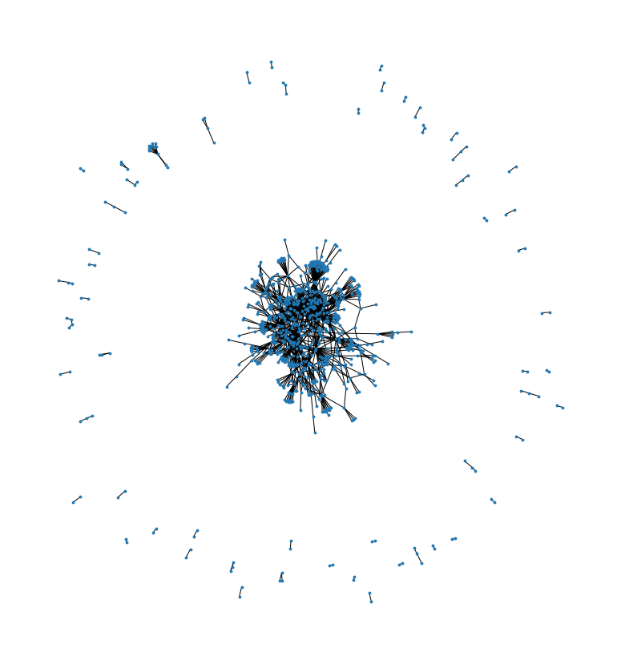
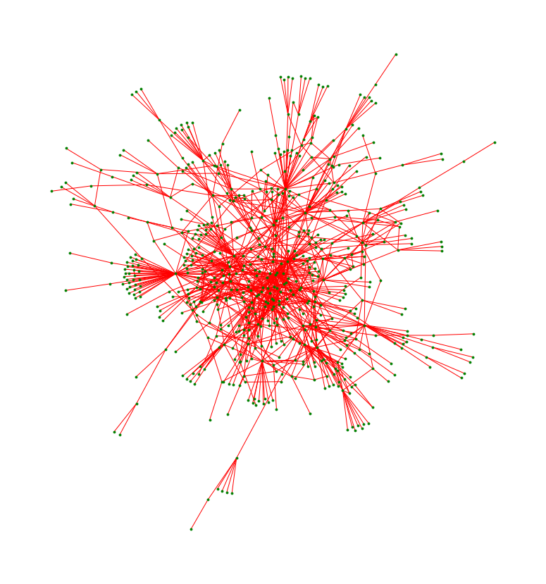

TODO: REVISE
# Data Analysis Tutorial - Innate Immune System Proteins
In this tutorial, we will be looking at the set of protein interactions in the innate immune system, and see if we can find any trends between the graphical properties of proteins in the interaction network and their biological properties. 

## Initial Guesses
Before we begin looking for or analyzing data, we set some goals to provide direction, and so we make some theories. 
For the graphical properties, we can look at the degree of a protein (how many proteins this protein interacts with), and degrees of centrality, such as how many paths go through this protein. 
On the biological side, scientists have been able to take measurements on a massive number of proteins. Proteins are a sequence of amino acids that have folded in a particular way to act as catalysts for various chemical processes. One of the main things measured for a protein is its sequence, ie the composition of the string of amino acids. These sequences can be on the order of 100 amino acids long, and with 20 different amino acids and possibly several ways of folding the chain into a 3d shape, trying to analyze the sequence outside of possibly the number of amino acids present is outside the scope of this project. 
Other properties include the mass and length of a protein, the domains (3d substructures) in the protein, the biological processes it is involved in, and the locations in the tissue. 

We predict that proteins with a high degree, or degree of centrality will likely be larger, so as to have more locations on the protein where an interaction can take place. Further, we predict that these proteins will likely be spread out in the cell and the tissue, being present in multiple tissues/subcellular regions instead of just one or two. With more interactions, we also predict that the proteins will be involved in more biological processes. 


```python
# imports 
import numpy as np
import pandas as pd
import matplotlib.pyplot as plt
import networkx as nx
import re
import requests
from bs4 import BeautifulSoup
from sklearn.linear_model import LinearRegression
import io
import time
```

TODO: WHERE IS DATA FROM


```python
# Making a dataframe out of the innate immune system data file, and getting characteristics from it. 

interactionDF = pd.read_csv("./all.mitab/all.mitab", sep = "\t")
print(interactionDF.info())
pd.set_option('display.max_rows', None, 'display.max_columns', None)
display(interactionDF.head())
```

    <class 'pandas.core.frame.DataFrame'>
    RangeIndex: 418677 entries, 0 to 418676
    Data columns (total 42 columns):
     #   Column                               Non-Null Count   Dtype 
    ---  ------                               --------------   ----- 
     0   #unique_identifier_A                 418677 non-null  object
     1   unique_identifier_B                  418677 non-null  object
     2   alt_identifier_A                     418677 non-null  object
     3   alt_identifier_B                     418677 non-null  object
     4   alias_A                              418677 non-null  object
     5   alias_B                              418677 non-null  object
     6   interaction_detection_method         418677 non-null  object
     7   author                               418677 non-null  object
     8   pmid                                 418677 non-null  object
     9   ncbi_taxid_A                         418677 non-null  object
     10  ncbi_taxid_B                         418677 non-null  object
     11  interaction_type                     417823 non-null  object
     12  source_database                      418677 non-null  object
     13  idinteraction_in_source_db           418677 non-null  object
     14  confidence_score                     418677 non-null  object
     15  expansion_method                     418677 non-null  object
     16  biological_role_A                    418677 non-null  object
     17  biological_role_B                    418677 non-null  object
     18  exp_role_A                           418677 non-null  object
     19  exp_role_B                           418677 non-null  object
     20  interactor_type_A                    418677 non-null  object
     21  interactor_type_B                    418677 non-null  object
     22  xrefs_A                              418677 non-null  object
     23  xrefs_B                              418677 non-null  object
     24  xrefs_interaction                    418677 non-null  object
     25  annotations_A                        418677 non-null  object
     26  annotations_B                        418677 non-null  object
     27  annotations_interaction              418677 non-null  object
     28  ncbi_taxid_host_organism             418677 non-null  object
     29  parameters_interaction               418677 non-null  object
     30  creation_date                        418677 non-null  object
     31  update_date                          418677 non-null  object
     32  checksum_A                           418677 non-null  object
     33  checksum_B                           418677 non-null  object
     34  checksum_interaction                 418677 non-null  object
     35  negative                             418677 non-null  bool  
     36  features_A                           418677 non-null  object
     37  features_B                           418677 non-null  object
     38  stoichiometry_A                      418677 non-null  object
     39  stoichiometry_B                      418677 non-null  object
     40  participant_identification_method_A  418677 non-null  object
     41  participant_identification_method_B  418677 non-null  object
    dtypes: bool(1), object(41)
    memory usage: 131.4+ MB
    None


<div>
<style scoped>
    .dataframe tbody tr th:only-of-type {
        vertical-align: middle;
    }

    .dataframe tbody tr th {
        vertical-align: top;
    }

    .dataframe thead th {
        text-align: right;
    }
</style>
<table border="1" class="dataframe">
  <thead>
    <tr style="text-align: right;">
      <th></th>
      <th>#unique_identifier_A</th>
      <th>unique_identifier_B</th>
      <th>alt_identifier_A</th>
      <th>alt_identifier_B</th>
      <th>alias_A</th>
      <th>alias_B</th>
      <th>interaction_detection_method</th>
      <th>author</th>
      <th>pmid</th>
      <th>ncbi_taxid_A</th>
      <th>ncbi_taxid_B</th>
      <th>interaction_type</th>
      <th>source_database</th>
      <th>idinteraction_in_source_db</th>
      <th>confidence_score</th>
      <th>expansion_method</th>
      <th>biological_role_A</th>
      <th>biological_role_B</th>
      <th>exp_role_A</th>
      <th>exp_role_B</th>
      <th>interactor_type_A</th>
      <th>interactor_type_B</th>
      <th>xrefs_A</th>
      <th>xrefs_B</th>
      <th>xrefs_interaction</th>
      <th>annotations_A</th>
      <th>annotations_B</th>
      <th>annotations_interaction</th>
      <th>ncbi_taxid_host_organism</th>
      <th>parameters_interaction</th>
      <th>creation_date</th>
      <th>update_date</th>
      <th>checksum_A</th>
      <th>checksum_B</th>
      <th>checksum_interaction</th>
      <th>negative</th>
      <th>features_A</th>
      <th>features_B</th>
      <th>stoichiometry_A</th>
      <th>stoichiometry_B</th>
      <th>participant_identification_method_A</th>
      <th>participant_identification_method_B</th>
    </tr>
  </thead>
  <tbody>
    <tr>
      <th>0</th>
      <td>innatedb:IDBG-90895</td>
      <td>innatedb:IDBG-90895</td>
      <td>ensembl:ENSG00000132906</td>
      <td>ensembl:ENSG00000132906</td>
      <td>uniprotkb:CASP9_HUMAN|refseq:NP_127463|uniprot...</td>
      <td>uniprotkb:CASP9_HUMAN|refseq:NP_127463|uniprot...</td>
      <td>psi-mi:"MI:0114"(x-ray crystallography)</td>
      <td>Renatus et al. (2001)</td>
      <td>pubmed:11734640</td>
      <td>taxid:9606(Human)</td>
      <td>taxid:9606(Human)</td>
      <td>psi-mi:"MI:0915"(physical association)</td>
      <td>MI:0462(bind)</td>
      <td>BIND:100139</td>
      <td>lpr:4|hpr:4|np:1|</td>
      <td>-</td>
      <td>psi-mi:"MI:0499"(unspecified role)</td>
      <td>psi-mi:"MI:0499"(unspecified role)</td>
      <td>psi-mi:"MI:0499"(unspecified role)</td>
      <td>psi-mi:"MI:0499"(unspecified role)</td>
      <td>psi-mi:"MI:0326"(protein)</td>
      <td>psi-mi:"MI:0326"(protein)</td>
      <td>-</td>
      <td>-</td>
      <td>-</td>
      <td>-</td>
      <td>-</td>
      <td>comment:"BIND interaction division: BIND-3DBP; "</td>
      <td>taxid:0</td>
      <td>-</td>
      <td>2014/11/29</td>
      <td>2014/11/29</td>
      <td>-</td>
      <td>-</td>
      <td>-</td>
      <td>False</td>
      <td>-</td>
      <td>-</td>
      <td>-</td>
      <td>-</td>
      <td>psi-mi:"MI:0363"(inferred by author)</td>
      <td>psi-mi:"MI:0363"(inferred by author)</td>
    </tr>
    <tr>
      <th>1</th>
      <td>innatedb:IDBG-90895</td>
      <td>innatedb:IDBG-90895</td>
      <td>ensembl:ENSG00000132906</td>
      <td>ensembl:ENSG00000132906</td>
      <td>uniprotkb:CASP9_HUMAN|refseq:NP_127463|uniprot...</td>
      <td>uniprotkb:CASP9_HUMAN|refseq:NP_127463|uniprot...</td>
      <td>psi-mi:"MI:0114"(x-ray crystallography)</td>
      <td>Renatus et al. (2001)</td>
      <td>pubmed:11734640</td>
      <td>taxid:9606(Human)</td>
      <td>taxid:9606(Human)</td>
      <td>psi-mi:"MI:0915"(physical association)</td>
      <td>MI:0462(bind)</td>
      <td>BIND:100140</td>
      <td>lpr:4|hpr:4|np:1|</td>
      <td>-</td>
      <td>psi-mi:"MI:0499"(unspecified role)</td>
      <td>psi-mi:"MI:0499"(unspecified role)</td>
      <td>psi-mi:"MI:0499"(unspecified role)</td>
      <td>psi-mi:"MI:0499"(unspecified role)</td>
      <td>psi-mi:"MI:0326"(protein)</td>
      <td>psi-mi:"MI:0326"(protein)</td>
      <td>-</td>
      <td>-</td>
      <td>-</td>
      <td>-</td>
      <td>-</td>
      <td>comment:"BIND interaction division: BIND-3DBP; "</td>
      <td>taxid:0</td>
      <td>-</td>
      <td>2014/11/29</td>
      <td>2014/11/29</td>
      <td>-</td>
      <td>-</td>
      <td>-</td>
      <td>False</td>
      <td>-</td>
      <td>-</td>
      <td>-</td>
      <td>-</td>
      <td>psi-mi:"MI:0363"(inferred by author)</td>
      <td>psi-mi:"MI:0363"(inferred by author)</td>
    </tr>
    <tr>
      <th>2</th>
      <td>innatedb:IDBG-90895</td>
      <td>innatedb:IDBG-90895</td>
      <td>ensembl:ENSG00000132906</td>
      <td>ensembl:ENSG00000132906</td>
      <td>uniprotkb:CASP9_HUMAN|refseq:NP_127463|uniprot...</td>
      <td>uniprotkb:CASP9_HUMAN|refseq:NP_127463|uniprot...</td>
      <td>psi-mi:"MI:0114"(x-ray crystallography)</td>
      <td>Renatus et al. (2001)</td>
      <td>pubmed:11734640</td>
      <td>taxid:9606(Human)</td>
      <td>taxid:9606(Human)</td>
      <td>psi-mi:"MI:0915"(physical association)</td>
      <td>MI:0462(bind)</td>
      <td>BIND:100141</td>
      <td>lpr:4|hpr:4|np:1|</td>
      <td>-</td>
      <td>psi-mi:"MI:0499"(unspecified role)</td>
      <td>psi-mi:"MI:0499"(unspecified role)</td>
      <td>psi-mi:"MI:0499"(unspecified role)</td>
      <td>psi-mi:"MI:0499"(unspecified role)</td>
      <td>psi-mi:"MI:0326"(protein)</td>
      <td>psi-mi:"MI:0326"(protein)</td>
      <td>-</td>
      <td>-</td>
      <td>-</td>
      <td>-</td>
      <td>-</td>
      <td>comment:"BIND interaction division: BIND-3DBP; "</td>
      <td>taxid:0</td>
      <td>-</td>
      <td>2014/11/29</td>
      <td>2014/11/29</td>
      <td>-</td>
      <td>-</td>
      <td>-</td>
      <td>False</td>
      <td>-</td>
      <td>-</td>
      <td>-</td>
      <td>-</td>
      <td>psi-mi:"MI:0363"(inferred by author)</td>
      <td>psi-mi:"MI:0363"(inferred by author)</td>
    </tr>
    <tr>
      <th>3</th>
      <td>innatedb:IDBG-96746</td>
      <td>innatedb:IDBG-73725</td>
      <td>ensembl:ENSG00000084072</td>
      <td>ensembl:ENSG00000118058</td>
      <td>refseq:NP_982281|uniprotkb:PPIE_HUMAN|uniprotk...</td>
      <td>uniprotkb:MLL1_HUMAN|refseq:NP_005924|uniprotk...</td>
      <td>psi-mi:"MI:0018"(two hybrid)</td>
      <td>Fair et al.(2001)</td>
      <td>pubmed:11313484</td>
      <td>taxid:9606(Human)</td>
      <td>taxid:9606(Human)</td>
      <td>psi-mi:"MI:0915"(physical association)</td>
      <td>MI:0463(biogrid)</td>
      <td>BIOGRID:10022</td>
      <td>lpr:6|hpr:6|np:1|</td>
      <td>-</td>
      <td>psi-mi:"MI:0499"(unspecified role)</td>
      <td>psi-mi:"MI:0499"(unspecified role)</td>
      <td>psi-mi:"MI:0498"(prey)</td>
      <td>psi-mi:"MI:0496"(bait)</td>
      <td>psi-mi:"MI:0326"(protein)</td>
      <td>psi-mi:"MI:0326"(protein)</td>
      <td>-</td>
      <td>-</td>
      <td>-</td>
      <td>-</td>
      <td>-</td>
      <td>comment:"BioGRID Evidence Code: Two-hybrid; "</td>
      <td>taxid:32644</td>
      <td>-</td>
      <td>2014/11/29</td>
      <td>2014/11/29</td>
      <td>-</td>
      <td>-</td>
      <td>-</td>
      <td>False</td>
      <td>-</td>
      <td>-</td>
      <td>-</td>
      <td>-</td>
      <td>psi-mi:"MI:0396"(predetermined participant)</td>
      <td>psi-mi:"MI:0396"(predetermined participant)</td>
    </tr>
    <tr>
      <th>4</th>
      <td>innatedb:IDBG-75670</td>
      <td>innatedb:IDBG-75670</td>
      <td>ensembl:ENSG00000148090</td>
      <td>ensembl:ENSG00000148090</td>
      <td>uniprotkb:AUHM_HUMAN|refseq:NP_001689|uniprotk...</td>
      <td>uniprotkb:AUHM_HUMAN|refseq:NP_001689|uniprotk...</td>
      <td>psi-mi:"MI:0114"(x-ray crystallography)</td>
      <td>Kurimoto et al. (2001)</td>
      <td>pubmed:11738050</td>
      <td>taxid:9606(Human)</td>
      <td>taxid:9606(Human)</td>
      <td>psi-mi:"MI:0915"(physical association)</td>
      <td>MI:0462(bind)</td>
      <td>BIND:100224</td>
      <td>lpr:6|hpr:6|np:1|</td>
      <td>-</td>
      <td>psi-mi:"MI:0499"(unspecified role)</td>
      <td>psi-mi:"MI:0499"(unspecified role)</td>
      <td>psi-mi:"MI:0499"(unspecified role)</td>
      <td>psi-mi:"MI:0499"(unspecified role)</td>
      <td>psi-mi:"MI:0326"(protein)</td>
      <td>psi-mi:"MI:0326"(protein)</td>
      <td>-</td>
      <td>-</td>
      <td>-</td>
      <td>-</td>
      <td>-</td>
      <td>comment:"BIND interaction division: BIND-3DBP; "</td>
      <td>taxid:0</td>
      <td>-</td>
      <td>2014/11/29</td>
      <td>2014/11/29</td>
      <td>-</td>
      <td>-</td>
      <td>-</td>
      <td>False</td>
      <td>-</td>
      <td>-</td>
      <td>-</td>
      <td>-</td>
      <td>psi-mi:"MI:0363"(inferred by author)</td>
      <td>psi-mi:"MI:0363"(inferred by author)</td>
    </tr>
  </tbody>
</table>
</div>


TODO: TAKE A LOOK PROSE


```python
# Taking a look at the network
edgeList = interactionDF[["#unique_identifier_A", "unique_identifier_B"]]
# removing self interaction edges, to reduce clutter
edgeListNoSelf = edgeList[edgeList["#unique_identifier_A"] != edgeList["unique_identifier_B"]]
print(edgeListNoSelf.shape)
G = nx.Graph(list(np.array(edgeListNoSelf.head(2000))))
plt.figure(figsize = [30,15])
subax1 = plt.subplot(121)
nx.draw(G, node_size = 8)
plt.show()
# getting the largest component
S = [G.subgraph(c).copy() for c in nx.connected_components(G)]
Sl = max(S, key=len)
print(Sl.size())
plt.figure(figsize = [30,15])
subax1 = plt.subplot(121)
nx.draw(Sl, node_size = 8, node_color = "green", edge_color = "red")
plt.show()
```

    (407990, 2)


    

    


    1079


    

    


TODO: UNKNOWN VALUES, USEFUL COLUMNS. WANT MORE DATA ON PROTEIN: UNIPROTKB. GRAPH OBSERVATION
## Uniprot
Start by mapping proteins to uniprotkb ids


```python
# Defining function to get the uniprotkb protein id, if it exists. 
def getUniprotkb(str):
    r = re.search("uniprotkb:([^_|]+)[|]", str + "|")
    if r:
        return r.group(1)
    else:
        return "NONE"
```


```python
# TODO ADD LENGTH CHECKS
# get mapping from innatedb unique identifier to uniprot ID
aProts = (interactionDF["#unique_identifier_A"] + "->" + interactionDF["alias_A"]).unique()
bProts = (interactionDF["unique_identifier_B"] + "->" + interactionDF["alias_B"]).unique()
allProts = np.unique(np.concatenate((aProts, bProts), axis = 0))

protDF  = pd.DataFrame([i.split("->") for i in allProts], columns = ["innateDB_ID","alias"])
protDF["UniprotID"] = protDF["alias"].apply(getUniprotkb)

# Display head, get the number of entries without a uniprotID
print(f"{pd.isna(protDF['UniprotID']).sum()} entries are missing a uniprotID out of {protDF.shape[0]}")
display(protDF.head())
print(f"Number of unique innatedb ids: {len(protDF['innateDB_ID'].unique())}")

```

    0 entries are missing a uniprotID out of 25271


<div>
<style scoped>
    .dataframe tbody tr th:only-of-type {
        vertical-align: middle;
    }

    .dataframe tbody tr th {
        vertical-align: top;
    }

    .dataframe thead th {
        text-align: right;
    }
</style>
<table border="1" class="dataframe">
  <thead>
    <tr style="text-align: right;">
      <th></th>
      <th>innateDB_ID</th>
      <th>alias</th>
      <th>UniprotID</th>
    </tr>
  </thead>
  <tbody>
    <tr>
      <th>0</th>
      <td>innatedb:IDBG-1</td>
      <td>refseq:NP_003131|uniprotkb:Q05066|uniprotkb:SR...</td>
      <td>Q05066</td>
    </tr>
    <tr>
      <th>1</th>
      <td>innatedb:IDBG-100000</td>
      <td>uniprotkb:LPAR3_HUMAN|refseq:NP_036284|uniprot...</td>
      <td>Q9UBY5</td>
    </tr>
    <tr>
      <th>2</th>
      <td>innatedb:IDBG-100012</td>
      <td>uniprotkb:Q8IWG1|uniprotkb:WDR63_HUMAN|refseq:...</td>
      <td>Q8IWG1</td>
    </tr>
    <tr>
      <th>3</th>
      <td>innatedb:IDBG-10002</td>
      <td>refseq:NP_056518|uniprotkb:Q9Y3A4|uniprotkb:RR...</td>
      <td>Q9Y3A4</td>
    </tr>
    <tr>
      <th>4</th>
      <td>innatedb:IDBG-100021</td>
      <td>uniprotkb:MCLN3_HUMAN|uniprotkb:Q8TDD5|refseq:...</td>
      <td>Q8TDD5</td>
    </tr>
  </tbody>
</table>
</div>


    Number of unique innatedb ids: 25271


### Querying
now we query uniprot TODO (describe API)


```python
# breaking the queries into blocks
def makeQueryList(n, ids):
    numBlocks = int((len(ids)/n + 1) - len(ids)/n % 1)
    queryList = []
    for i in range(numBlocks - 1):
        entry = "id:" + ids[i*n]
        for j in range(n-1):
            entry = entry + "+OR+id:" + ids[i*n + 1 + j]
        queryList.append(entry)
    entry = ids[(numBlocks-1)*n]
    for j in range(len(ids) - (numBlocks-1)*n - 1):
        entry = entry + "+OR+" + ids[(numBlocks-1)*n + 1 + j]
    return queryList

proteinQueryList = makeQueryList(100, np.array(protDF[~pd.isna(protDF['UniprotID'])]['UniprotID']))
columns = "columns=id,entry name,organism,mass,length,comment(TISSUE SPECIFICITY),comment(DISEASE),comment(SUBCELLULAR LOCATION),go,comment(DOMAIN),families,feature(DOMAIN EXTENT)"
fmt = "format=tab"
```


```python

```

    Progress
    ____________________________________________________________________________________________________
    ====================================================================================================


```python
# querying the database for information on the proteins
colQuery = requests.get("https://www.uniprot.org/uniprot/?query=" + protDF[~pd.isna(protDF['UniprotID'])]['UniprotID'][0] + "&" + columns + "&" + fmt)
temp = pd.read_csv(io.StringIO(colQuery.text), sep = "\t")
uniprotDF = pd.DataFrame(columns = temp.columns)
print("Progress\n" + "_"*100)
for i in range(len(proteinQueryList)):
    # make request
    r = requests.get("https://www.uniprot.org/uniprot/?query=" + proteinQueryList[i] + "&" + columns + "&" + fmt)
    temp = pd.read_csv(io.StringIO(r.text), sep = "\t")
    uniprotDF = uniprotDF.merge(temp, how = "outer")
    if i/len(proteinQueryList) % .01 < (i-1)/len(proteinQueryList) % .01: print("=", end = "")
    time.sleep(1)
```

    Progress
    ____________________________________________________________________________________________________
    ====================================================================================================


```python
print(uniprotDF.shape)
display(uniprotDF.head())
```

    (23655, 12)


<div>
<style scoped>
    .dataframe tbody tr th:only-of-type {
        vertical-align: middle;
    }

    .dataframe tbody tr th {
        vertical-align: top;
    }

    .dataframe thead th {
        text-align: right;
    }
</style>
<table border="1" class="dataframe">
  <thead>
    <tr style="text-align: right;">
      <th></th>
      <th>Entry</th>
      <th>Entry name</th>
      <th>Organism</th>
      <th>Mass</th>
      <th>Length</th>
      <th>Tissue specificity</th>
      <th>Involvement in disease</th>
      <th>Subcellular location [CC]</th>
      <th>Gene ontology (GO)</th>
      <th>Domain [CC]</th>
      <th>Protein families</th>
      <th>Domain [FT]</th>
    </tr>
  </thead>
  <tbody>
    <tr>
      <th>0</th>
      <td>P19320</td>
      <td>VCAM1_HUMAN</td>
      <td>Homo sapiens (Human)</td>
      <td>81,276</td>
      <td>739.0</td>
      <td>TISSUE SPECIFICITY: Expressed on inflamed vasc...</td>
      <td>NaN</td>
      <td>SUBCELLULAR LOCATION: Membrane; Single-pass ty...</td>
      <td>alpha9-beta1 integrin-vascular cell adhesion m...</td>
      <td>DOMAIN: Either the first or the fourth Ig-like...</td>
      <td>NaN</td>
      <td>DOMAIN 25..105;  /note="Ig-like C2-type 1"; DO...</td>
    </tr>
    <tr>
      <th>1</th>
      <td>P36543</td>
      <td>VATE1_HUMAN</td>
      <td>Homo sapiens (Human)</td>
      <td>26,145</td>
      <td>226.0</td>
      <td>TISSUE SPECIFICITY: Kidney; localizes to early...</td>
      <td>DISEASE: Cutis laxa, autosomal recessive, 2C (...</td>
      <td>SUBCELLULAR LOCATION: Apical cell membrane {EC...</td>
      <td>apical plasma membrane [GO:0016324]; cytosol [...</td>
      <td>NaN</td>
      <td>V-ATPase E subunit family</td>
      <td>NaN</td>
    </tr>
    <tr>
      <th>2</th>
      <td>Q9UKA9</td>
      <td>PTBP2_HUMAN</td>
      <td>Homo sapiens (Human)</td>
      <td>57,491</td>
      <td>531.0</td>
      <td>TISSUE SPECIFICITY: Mainly expressed in brain ...</td>
      <td>NaN</td>
      <td>SUBCELLULAR LOCATION: Nucleus {ECO:0000250|Uni...</td>
      <td>growth cone [GO:0030426]; neuronal cell body [...</td>
      <td>NaN</td>
      <td>NaN</td>
      <td>DOMAIN 59..133;  /note="RRM 1";  /evidence="EC...</td>
    </tr>
    <tr>
      <th>3</th>
      <td>Q96NR8</td>
      <td>RDH12_HUMAN</td>
      <td>Homo sapiens (Human)</td>
      <td>35,094</td>
      <td>316.0</td>
      <td>TISSUE SPECIFICITY: Widely expressed, mostly i...</td>
      <td>DISEASE: Leber congenital amaurosis 13 (LCA13)...</td>
      <td>SUBCELLULAR LOCATION: Endoplasmic reticulum me...</td>
      <td>endoplasmic reticulum membrane [GO:0005789]; p...</td>
      <td>NaN</td>
      <td>Short-chain dehydrogenases/reductases (SDR) fa...</td>
      <td>NaN</td>
    </tr>
    <tr>
      <th>4</th>
      <td>Q52LW3</td>
      <td>RHG29_HUMAN</td>
      <td>Homo sapiens (Human)</td>
      <td>142,064</td>
      <td>1261.0</td>
      <td>TISSUE SPECIFICITY: Widely expressed. Highly e...</td>
      <td>NaN</td>
      <td>NaN</td>
      <td>cytoplasm [GO:0005737]; cytosol [GO:0005829]; ...</td>
      <td>NaN</td>
      <td>NaN</td>
      <td>DOMAIN 192..462;  /note="F-BAR";  /evidence="E...</td>
    </tr>
  </tbody>
</table>
</div>


```python
print(protDF.shape)
print(uniprotDF.shape)

display(protDF.head())
display(uniprotDF.head())
```

    (25271, 3)
    (23655, 12)


<div>
<style scoped>
    .dataframe tbody tr th:only-of-type {
        vertical-align: middle;
    }

    .dataframe tbody tr th {
        vertical-align: top;
    }

    .dataframe thead th {
        text-align: right;
    }
</style>
<table border="1" class="dataframe">
  <thead>
    <tr style="text-align: right;">
      <th></th>
      <th>innateDB_ID</th>
      <th>alias</th>
      <th>UniprotID</th>
    </tr>
  </thead>
  <tbody>
    <tr>
      <th>0</th>
      <td>innatedb:IDBG-1</td>
      <td>refseq:NP_003131|uniprotkb:Q05066|uniprotkb:SR...</td>
      <td>Q05066</td>
    </tr>
    <tr>
      <th>1</th>
      <td>innatedb:IDBG-100000</td>
      <td>uniprotkb:LPAR3_HUMAN|refseq:NP_036284|uniprot...</td>
      <td>Q9UBY5</td>
    </tr>
    <tr>
      <th>2</th>
      <td>innatedb:IDBG-100012</td>
      <td>uniprotkb:Q8IWG1|uniprotkb:WDR63_HUMAN|refseq:...</td>
      <td>Q8IWG1</td>
    </tr>
    <tr>
      <th>3</th>
      <td>innatedb:IDBG-10002</td>
      <td>refseq:NP_056518|uniprotkb:Q9Y3A4|uniprotkb:RR...</td>
      <td>Q9Y3A4</td>
    </tr>
    <tr>
      <th>4</th>
      <td>innatedb:IDBG-100021</td>
      <td>uniprotkb:MCLN3_HUMAN|uniprotkb:Q8TDD5|refseq:...</td>
      <td>Q8TDD5</td>
    </tr>
  </tbody>
</table>
</div>


<div>
<style scoped>
    .dataframe tbody tr th:only-of-type {
        vertical-align: middle;
    }

    .dataframe tbody tr th {
        vertical-align: top;
    }

    .dataframe thead th {
        text-align: right;
    }
</style>
<table border="1" class="dataframe">
  <thead>
    <tr style="text-align: right;">
      <th></th>
      <th>Entry</th>
      <th>Entry name</th>
      <th>Organism</th>
      <th>Mass</th>
      <th>Length</th>
      <th>Tissue specificity</th>
      <th>Involvement in disease</th>
      <th>Subcellular location [CC]</th>
      <th>Gene ontology (GO)</th>
      <th>Domain [CC]</th>
      <th>Protein families</th>
      <th>Domain [FT]</th>
    </tr>
  </thead>
  <tbody>
    <tr>
      <th>0</th>
      <td>P19320</td>
      <td>VCAM1_HUMAN</td>
      <td>Homo sapiens (Human)</td>
      <td>81,276</td>
      <td>739.0</td>
      <td>TISSUE SPECIFICITY: Expressed on inflamed vasc...</td>
      <td>NaN</td>
      <td>SUBCELLULAR LOCATION: Membrane; Single-pass ty...</td>
      <td>alpha9-beta1 integrin-vascular cell adhesion m...</td>
      <td>DOMAIN: Either the first or the fourth Ig-like...</td>
      <td>NaN</td>
      <td>DOMAIN 25..105;  /note="Ig-like C2-type 1"; DO...</td>
    </tr>
    <tr>
      <th>1</th>
      <td>P36543</td>
      <td>VATE1_HUMAN</td>
      <td>Homo sapiens (Human)</td>
      <td>26,145</td>
      <td>226.0</td>
      <td>TISSUE SPECIFICITY: Kidney; localizes to early...</td>
      <td>DISEASE: Cutis laxa, autosomal recessive, 2C (...</td>
      <td>SUBCELLULAR LOCATION: Apical cell membrane {EC...</td>
      <td>apical plasma membrane [GO:0016324]; cytosol [...</td>
      <td>NaN</td>
      <td>V-ATPase E subunit family</td>
      <td>NaN</td>
    </tr>
    <tr>
      <th>2</th>
      <td>Q9UKA9</td>
      <td>PTBP2_HUMAN</td>
      <td>Homo sapiens (Human)</td>
      <td>57,491</td>
      <td>531.0</td>
      <td>TISSUE SPECIFICITY: Mainly expressed in brain ...</td>
      <td>NaN</td>
      <td>SUBCELLULAR LOCATION: Nucleus {ECO:0000250|Uni...</td>
      <td>growth cone [GO:0030426]; neuronal cell body [...</td>
      <td>NaN</td>
      <td>NaN</td>
      <td>DOMAIN 59..133;  /note="RRM 1";  /evidence="EC...</td>
    </tr>
    <tr>
      <th>3</th>
      <td>Q96NR8</td>
      <td>RDH12_HUMAN</td>
      <td>Homo sapiens (Human)</td>
      <td>35,094</td>
      <td>316.0</td>
      <td>TISSUE SPECIFICITY: Widely expressed, mostly i...</td>
      <td>DISEASE: Leber congenital amaurosis 13 (LCA13)...</td>
      <td>SUBCELLULAR LOCATION: Endoplasmic reticulum me...</td>
      <td>endoplasmic reticulum membrane [GO:0005789]; p...</td>
      <td>NaN</td>
      <td>Short-chain dehydrogenases/reductases (SDR) fa...</td>
      <td>NaN</td>
    </tr>
    <tr>
      <th>4</th>
      <td>Q52LW3</td>
      <td>RHG29_HUMAN</td>
      <td>Homo sapiens (Human)</td>
      <td>142,064</td>
      <td>1261.0</td>
      <td>TISSUE SPECIFICITY: Widely expressed. Highly e...</td>
      <td>NaN</td>
      <td>NaN</td>
      <td>cytoplasm [GO:0005737]; cytosol [GO:0005829]; ...</td>
      <td>NaN</td>
      <td>NaN</td>
      <td>DOMAIN 192..462;  /note="F-BAR";  /evidence="E...</td>
    </tr>
  </tbody>
</table>
</div>


```python
# merging the dataframes using the equivalent to SQL's left join, on the uniprot ID.
fullProtDF = protDF.merge(uniprotDF, how = "left", left_on = "UniprotID", right_on = "Entry")
print(fullProtDF.info())
display(fullProtDF.head())
```

    <class 'pandas.core.frame.DataFrame'>
    Int64Index: 25271 entries, 0 to 25270
    Data columns (total 15 columns):
     #   Column                     Non-Null Count  Dtype  
    ---  ------                     --------------  -----  
     0   innateDB_ID                25271 non-null  object 
     1   alias                      25271 non-null  object 
     2   UniprotID                  25271 non-null  object 
     3   Entry                      23725 non-null  object 
     4   Entry name                 23725 non-null  object 
     5   Organism                   23676 non-null  object 
     6   Mass                       23676 non-null  object 
     7   Length                     23676 non-null  float64
     8   Tissue specificity         12533 non-null  object 
     9   Involvement in disease     4462 non-null   object 
     10  Subcellular location [CC]  20921 non-null  object 
     11  Gene ontology (GO)         23312 non-null  object 
     12  Domain [CC]                5426 non-null   object 
     13  Protein families           17706 non-null  object 
     14  Domain [FT]                11014 non-null  object 
    dtypes: float64(1), object(14)
    memory usage: 3.1+ MB
    None


<div>
<style scoped>
    .dataframe tbody tr th:only-of-type {
        vertical-align: middle;
    }

    .dataframe tbody tr th {
        vertical-align: top;
    }

    .dataframe thead th {
        text-align: right;
    }
</style>
<table border="1" class="dataframe">
  <thead>
    <tr style="text-align: right;">
      <th></th>
      <th>innateDB_ID</th>
      <th>alias</th>
      <th>UniprotID</th>
      <th>Entry</th>
      <th>Entry name</th>
      <th>Organism</th>
      <th>Mass</th>
      <th>Length</th>
      <th>Tissue specificity</th>
      <th>Involvement in disease</th>
      <th>Subcellular location [CC]</th>
      <th>Gene ontology (GO)</th>
      <th>Domain [CC]</th>
      <th>Protein families</th>
      <th>Domain [FT]</th>
    </tr>
  </thead>
  <tbody>
    <tr>
      <th>0</th>
      <td>innatedb:IDBG-1</td>
      <td>refseq:NP_003131|uniprotkb:Q05066|uniprotkb:SR...</td>
      <td>Q05066</td>
      <td>Q05066</td>
      <td>SRY_HUMAN</td>
      <td>Homo sapiens (Human)</td>
      <td>23,884</td>
      <td>204.0</td>
      <td>NaN</td>
      <td>DISEASE: 46,XY sex reversal 1 (SRXY1) [MIM:400...</td>
      <td>SUBCELLULAR LOCATION: Nucleus speckle {ECO:000...</td>
      <td>chromatin [GO:0000785]; cytoplasm [GO:0005737]...</td>
      <td>DOMAIN: DNA binding and bending properties of ...</td>
      <td>SRY family</td>
      <td>NaN</td>
    </tr>
    <tr>
      <th>1</th>
      <td>innatedb:IDBG-100000</td>
      <td>uniprotkb:LPAR3_HUMAN|refseq:NP_036284|uniprot...</td>
      <td>Q9UBY5</td>
      <td>Q9UBY5</td>
      <td>LPAR3_HUMAN</td>
      <td>Homo sapiens (Human)</td>
      <td>40,128</td>
      <td>353.0</td>
      <td>TISSUE SPECIFICITY: Most abundantly expressed ...</td>
      <td>NaN</td>
      <td>SUBCELLULAR LOCATION: Cell membrane; Multi-pas...</td>
      <td>axon [GO:0030424]; cytoplasm [GO:0005737]; int...</td>
      <td>NaN</td>
      <td>G-protein coupled receptor 1 family</td>
      <td>NaN</td>
    </tr>
    <tr>
      <th>2</th>
      <td>innatedb:IDBG-100012</td>
      <td>uniprotkb:Q8IWG1|uniprotkb:WDR63_HUMAN|refseq:...</td>
      <td>Q8IWG1</td>
      <td>Q8IWG1</td>
      <td>DNAI3_HUMAN</td>
      <td>Homo sapiens (Human)</td>
      <td>102,935</td>
      <td>891.0</td>
      <td>NaN</td>
      <td>DISEASE: Note=A rare heterozygous in-frame DNA...</td>
      <td>SUBCELLULAR LOCATION: Cytoplasm {ECO:0000269|P...</td>
      <td>axonemal dynein complex [GO:0005858]; cytoplas...</td>
      <td>NaN</td>
      <td>NaN</td>
      <td>NaN</td>
    </tr>
    <tr>
      <th>3</th>
      <td>innatedb:IDBG-10002</td>
      <td>refseq:NP_056518|uniprotkb:Q9Y3A4|uniprotkb:RR...</td>
      <td>Q9Y3A4</td>
      <td>Q9Y3A4</td>
      <td>RRP7A_HUMAN</td>
      <td>Homo sapiens (Human)</td>
      <td>32,334</td>
      <td>280.0</td>
      <td>NaN</td>
      <td>NaN</td>
      <td>NaN</td>
      <td>CURI complex [GO:0032545]; cytoplasm [GO:00057...</td>
      <td>NaN</td>
      <td>RRP7 family</td>
      <td>DOMAIN 61..90;  /note="RRM"</td>
    </tr>
    <tr>
      <th>4</th>
      <td>innatedb:IDBG-100021</td>
      <td>uniprotkb:MCLN3_HUMAN|uniprotkb:Q8TDD5|refseq:...</td>
      <td>Q8TDD5</td>
      <td>Q8TDD5</td>
      <td>MCLN3_HUMAN</td>
      <td>Homo sapiens (Human)</td>
      <td>64,248</td>
      <td>553.0</td>
      <td>NaN</td>
      <td>NaN</td>
      <td>SUBCELLULAR LOCATION: Cell membrane {ECO:00002...</td>
      <td>autophagosome membrane [GO:0000421]; early end...</td>
      <td>DOMAIN: The most N-terminal extracellular/lume...</td>
      <td>Transient receptor (TC 1.A.4) family, Polycyst...</td>
      <td>NaN</td>
    </tr>
  </tbody>
</table>
</div>


LOOK AT "INVOLVEMENT IN DISEASE", "GENE ONTOLOGY (GO)", "DOMAIN [FT]"


```python
getMIM(None)
```


    ---------------------------------------------------------------------------

    TypeError                                 Traceback (most recent call last)

    Input In [317], in <module>
    ----> 1 getMIM(None)


    Input In [316], in getMIM(str)
          2 def getMIM(str):
    ----> 3     return re.findall("\[MIM:(\d+)\]", str)


    File /opt/conda/lib/python3.9/re.py:241, in findall(pattern, string, flags)
        233 def findall(pattern, string, flags=0):
        234     """Return a list of all non-overlapping matches in the string.
        235 
        236     If one or more capturing groups are present in the pattern, return
       (...)
        239 
        240     Empty matches are included in the result."""
    --> 241     return _compile(pattern, flags).findall(string)


    TypeError: expected string or bytes-like object


```python
# process into list of MIM ids
def getMIM(s):
    if pd.isna(s):
        return None
    else:
        return re.findall("\[MIM:(\d+)\]", s)
fullProtDF["MIM"] = fullProtDF["Involvement in disease"].apply(getMIM)
display(fullProtDF.head())

```


<div>
<style scoped>
    .dataframe tbody tr th:only-of-type {
        vertical-align: middle;
    }

    .dataframe tbody tr th {
        vertical-align: top;
    }

    .dataframe thead th {
        text-align: right;
    }
</style>
<table border="1" class="dataframe">
  <thead>
    <tr style="text-align: right;">
      <th></th>
      <th>innateDB_ID</th>
      <th>alias</th>
      <th>UniprotID</th>
      <th>Entry</th>
      <th>Entry name</th>
      <th>Organism</th>
      <th>Mass</th>
      <th>Length</th>
      <th>Tissue specificity</th>
      <th>Involvement in disease</th>
      <th>Subcellular location [CC]</th>
      <th>Gene ontology (GO)</th>
      <th>Domain [CC]</th>
      <th>Protein families</th>
      <th>Domain [FT]</th>
      <th>Degree_Centrality</th>
      <th>flMass</th>
      <th>MIM</th>
    </tr>
  </thead>
  <tbody>
    <tr>
      <th>0</th>
      <td>innatedb:IDBG-1</td>
      <td>refseq:NP_003131|uniprotkb:Q05066|uniprotkb:SR...</td>
      <td>Q05066</td>
      <td>Q05066</td>
      <td>SRY_HUMAN</td>
      <td>Homo sapiens (Human)</td>
      <td>23,884</td>
      <td>204.0</td>
      <td>NaN</td>
      <td>DISEASE: 46,XY sex reversal 1 (SRXY1) [MIM:400...</td>
      <td>SUBCELLULAR LOCATION: Nucleus speckle {ECO:000...</td>
      <td>chromatin [GO:0000785]; cytoplasm [GO:0005737]...</td>
      <td>DOMAIN: DNA binding and bending properties of ...</td>
      <td>SRY family</td>
      <td>NaN</td>
      <td>0.000953</td>
      <td>23884.0</td>
      <td>[400044, 400045]</td>
    </tr>
    <tr>
      <th>1</th>
      <td>innatedb:IDBG-100000</td>
      <td>uniprotkb:LPAR3_HUMAN|refseq:NP_036284|uniprot...</td>
      <td>Q9UBY5</td>
      <td>Q9UBY5</td>
      <td>LPAR3_HUMAN</td>
      <td>Homo sapiens (Human)</td>
      <td>40,128</td>
      <td>353.0</td>
      <td>TISSUE SPECIFICITY: Most abundantly expressed ...</td>
      <td>NaN</td>
      <td>SUBCELLULAR LOCATION: Cell membrane; Multi-pas...</td>
      <td>axon [GO:0030424]; cytoplasm [GO:0005737]; int...</td>
      <td>NaN</td>
      <td>G-protein coupled receptor 1 family</td>
      <td>NaN</td>
      <td>0.000079</td>
      <td>40128.0</td>
      <td>None</td>
    </tr>
    <tr>
      <th>2</th>
      <td>innatedb:IDBG-100012</td>
      <td>uniprotkb:Q8IWG1|uniprotkb:WDR63_HUMAN|refseq:...</td>
      <td>Q8IWG1</td>
      <td>Q8IWG1</td>
      <td>DNAI3_HUMAN</td>
      <td>Homo sapiens (Human)</td>
      <td>102,935</td>
      <td>891.0</td>
      <td>NaN</td>
      <td>DISEASE: Note=A rare heterozygous in-frame DNA...</td>
      <td>SUBCELLULAR LOCATION: Cytoplasm {ECO:0000269|P...</td>
      <td>axonemal dynein complex [GO:0005858]; cytoplas...</td>
      <td>NaN</td>
      <td>NaN</td>
      <td>NaN</td>
      <td>0.000040</td>
      <td>102935.0</td>
      <td>[]</td>
    </tr>
    <tr>
      <th>3</th>
      <td>innatedb:IDBG-10002</td>
      <td>refseq:NP_056518|uniprotkb:Q9Y3A4|uniprotkb:RR...</td>
      <td>Q9Y3A4</td>
      <td>Q9Y3A4</td>
      <td>RRP7A_HUMAN</td>
      <td>Homo sapiens (Human)</td>
      <td>32,334</td>
      <td>280.0</td>
      <td>NaN</td>
      <td>NaN</td>
      <td>NaN</td>
      <td>CURI complex [GO:0032545]; cytoplasm [GO:00057...</td>
      <td>NaN</td>
      <td>RRP7 family</td>
      <td>DOMAIN 61..90;  /note="RRM"</td>
      <td>0.001033</td>
      <td>32334.0</td>
      <td>None</td>
    </tr>
    <tr>
      <th>4</th>
      <td>innatedb:IDBG-100021</td>
      <td>uniprotkb:MCLN3_HUMAN|uniprotkb:Q8TDD5|refseq:...</td>
      <td>Q8TDD5</td>
      <td>Q8TDD5</td>
      <td>MCLN3_HUMAN</td>
      <td>Homo sapiens (Human)</td>
      <td>64,248</td>
      <td>553.0</td>
      <td>NaN</td>
      <td>NaN</td>
      <td>SUBCELLULAR LOCATION: Cell membrane {ECO:00002...</td>
      <td>autophagosome membrane [GO:0000421]; early end...</td>
      <td>DOMAIN: The most N-terminal extracellular/lume...</td>
      <td>Transient receptor (TC 1.A.4) family, Polycyst...</td>
      <td>NaN</td>
      <td>0.000079</td>
      <td>64248.0</td>
      <td>None</td>
    </tr>
  </tbody>
</table>
</div>


```python
# process domain column into list of IDs
def getDOM(s):
    if pd.isna(s):
        return None
    else:
        return re.findall('/note="([\w\s-]+)"', s)
fullProtDF["Domain_ID"] = fullProtDF["Domain [FT]"].apply(getDOM)
display(fullProtDF.head())

```


<div>
<style scoped>
    .dataframe tbody tr th:only-of-type {
        vertical-align: middle;
    }

    .dataframe tbody tr th {
        vertical-align: top;
    }

    .dataframe thead th {
        text-align: right;
    }
</style>
<table border="1" class="dataframe">
  <thead>
    <tr style="text-align: right;">
      <th></th>
      <th>innateDB_ID</th>
      <th>alias</th>
      <th>UniprotID</th>
      <th>Entry</th>
      <th>Entry name</th>
      <th>Organism</th>
      <th>Mass</th>
      <th>Length</th>
      <th>Tissue specificity</th>
      <th>Involvement in disease</th>
      <th>Subcellular location [CC]</th>
      <th>Gene ontology (GO)</th>
      <th>Domain [CC]</th>
      <th>Protein families</th>
      <th>Domain [FT]</th>
      <th>Degree_Centrality</th>
      <th>flMass</th>
      <th>MIM</th>
      <th>Domain_ID</th>
    </tr>
  </thead>
  <tbody>
    <tr>
      <th>0</th>
      <td>innatedb:IDBG-1</td>
      <td>refseq:NP_003131|uniprotkb:Q05066|uniprotkb:SR...</td>
      <td>Q05066</td>
      <td>Q05066</td>
      <td>SRY_HUMAN</td>
      <td>Homo sapiens (Human)</td>
      <td>23,884</td>
      <td>204.0</td>
      <td>NaN</td>
      <td>DISEASE: 46,XY sex reversal 1 (SRXY1) [MIM:400...</td>
      <td>SUBCELLULAR LOCATION: Nucleus speckle {ECO:000...</td>
      <td>chromatin [GO:0000785]; cytoplasm [GO:0005737]...</td>
      <td>DOMAIN: DNA binding and bending properties of ...</td>
      <td>SRY family</td>
      <td>NaN</td>
      <td>0.000953</td>
      <td>23884.0</td>
      <td>[400044, 400045]</td>
      <td>None</td>
    </tr>
    <tr>
      <th>1</th>
      <td>innatedb:IDBG-100000</td>
      <td>uniprotkb:LPAR3_HUMAN|refseq:NP_036284|uniprot...</td>
      <td>Q9UBY5</td>
      <td>Q9UBY5</td>
      <td>LPAR3_HUMAN</td>
      <td>Homo sapiens (Human)</td>
      <td>40,128</td>
      <td>353.0</td>
      <td>TISSUE SPECIFICITY: Most abundantly expressed ...</td>
      <td>NaN</td>
      <td>SUBCELLULAR LOCATION: Cell membrane; Multi-pas...</td>
      <td>axon [GO:0030424]; cytoplasm [GO:0005737]; int...</td>
      <td>NaN</td>
      <td>G-protein coupled receptor 1 family</td>
      <td>NaN</td>
      <td>0.000079</td>
      <td>40128.0</td>
      <td>None</td>
      <td>None</td>
    </tr>
    <tr>
      <th>2</th>
      <td>innatedb:IDBG-100012</td>
      <td>uniprotkb:Q8IWG1|uniprotkb:WDR63_HUMAN|refseq:...</td>
      <td>Q8IWG1</td>
      <td>Q8IWG1</td>
      <td>DNAI3_HUMAN</td>
      <td>Homo sapiens (Human)</td>
      <td>102,935</td>
      <td>891.0</td>
      <td>NaN</td>
      <td>DISEASE: Note=A rare heterozygous in-frame DNA...</td>
      <td>SUBCELLULAR LOCATION: Cytoplasm {ECO:0000269|P...</td>
      <td>axonemal dynein complex [GO:0005858]; cytoplas...</td>
      <td>NaN</td>
      <td>NaN</td>
      <td>NaN</td>
      <td>0.000040</td>
      <td>102935.0</td>
      <td>[]</td>
      <td>None</td>
    </tr>
    <tr>
      <th>3</th>
      <td>innatedb:IDBG-10002</td>
      <td>refseq:NP_056518|uniprotkb:Q9Y3A4|uniprotkb:RR...</td>
      <td>Q9Y3A4</td>
      <td>Q9Y3A4</td>
      <td>RRP7A_HUMAN</td>
      <td>Homo sapiens (Human)</td>
      <td>32,334</td>
      <td>280.0</td>
      <td>NaN</td>
      <td>NaN</td>
      <td>NaN</td>
      <td>CURI complex [GO:0032545]; cytoplasm [GO:00057...</td>
      <td>NaN</td>
      <td>RRP7 family</td>
      <td>DOMAIN 61..90;  /note="RRM"</td>
      <td>0.001033</td>
      <td>32334.0</td>
      <td>None</td>
      <td>[RRM]</td>
    </tr>
    <tr>
      <th>4</th>
      <td>innatedb:IDBG-100021</td>
      <td>uniprotkb:MCLN3_HUMAN|uniprotkb:Q8TDD5|refseq:...</td>
      <td>Q8TDD5</td>
      <td>Q8TDD5</td>
      <td>MCLN3_HUMAN</td>
      <td>Homo sapiens (Human)</td>
      <td>64,248</td>
      <td>553.0</td>
      <td>NaN</td>
      <td>NaN</td>
      <td>SUBCELLULAR LOCATION: Cell membrane {ECO:00002...</td>
      <td>autophagosome membrane [GO:0000421]; early end...</td>
      <td>DOMAIN: The most N-terminal extracellular/lume...</td>
      <td>Transient receptor (TC 1.A.4) family, Polycyst...</td>
      <td>NaN</td>
      <td>0.000079</td>
      <td>64248.0</td>
      <td>None</td>
      <td>None</td>
    </tr>
  </tbody>
</table>
</div>


```python
# process to get GO IDs
def getGO(s):
    if pd.isna(s):
        return None
    else:
        return re.findall("\[GO:(\d+)\]", s)
fullProtDF["GO_ID"] = fullProtDF["Gene ontology (GO)"].apply(getGO)
display(fullProtDF.head())

```


<div>
<style scoped>
    .dataframe tbody tr th:only-of-type {
        vertical-align: middle;
    }

    .dataframe tbody tr th {
        vertical-align: top;
    }

    .dataframe thead th {
        text-align: right;
    }
</style>
<table border="1" class="dataframe">
  <thead>
    <tr style="text-align: right;">
      <th></th>
      <th>innateDB_ID</th>
      <th>alias</th>
      <th>UniprotID</th>
      <th>Entry</th>
      <th>Entry name</th>
      <th>Organism</th>
      <th>Mass</th>
      <th>Length</th>
      <th>Tissue specificity</th>
      <th>Involvement in disease</th>
      <th>Subcellular location [CC]</th>
      <th>Gene ontology (GO)</th>
      <th>Domain [CC]</th>
      <th>Protein families</th>
      <th>Domain [FT]</th>
      <th>Degree_Centrality</th>
      <th>flMass</th>
      <th>MIM</th>
      <th>Domain_ID</th>
      <th>GO_ID</th>
    </tr>
  </thead>
  <tbody>
    <tr>
      <th>0</th>
      <td>innatedb:IDBG-1</td>
      <td>refseq:NP_003131|uniprotkb:Q05066|uniprotkb:SR...</td>
      <td>Q05066</td>
      <td>Q05066</td>
      <td>SRY_HUMAN</td>
      <td>Homo sapiens (Human)</td>
      <td>23,884</td>
      <td>204.0</td>
      <td>NaN</td>
      <td>DISEASE: 46,XY sex reversal 1 (SRXY1) [MIM:400...</td>
      <td>SUBCELLULAR LOCATION: Nucleus speckle {ECO:000...</td>
      <td>chromatin [GO:0000785]; cytoplasm [GO:0005737]...</td>
      <td>DOMAIN: DNA binding and bending properties of ...</td>
      <td>SRY family</td>
      <td>NaN</td>
      <td>0.000953</td>
      <td>23884.0</td>
      <td>[400044, 400045]</td>
      <td>None</td>
      <td>[0000785, 0005737, 0016607, 0005654, 0005634, ...</td>
    </tr>
    <tr>
      <th>1</th>
      <td>innatedb:IDBG-100000</td>
      <td>uniprotkb:LPAR3_HUMAN|refseq:NP_036284|uniprot...</td>
      <td>Q9UBY5</td>
      <td>Q9UBY5</td>
      <td>LPAR3_HUMAN</td>
      <td>Homo sapiens (Human)</td>
      <td>40,128</td>
      <td>353.0</td>
      <td>TISSUE SPECIFICITY: Most abundantly expressed ...</td>
      <td>NaN</td>
      <td>SUBCELLULAR LOCATION: Cell membrane; Multi-pas...</td>
      <td>axon [GO:0030424]; cytoplasm [GO:0005737]; int...</td>
      <td>NaN</td>
      <td>G-protein coupled receptor 1 family</td>
      <td>NaN</td>
      <td>0.000079</td>
      <td>40128.0</td>
      <td>None</td>
      <td>None</td>
      <td>[0030424, 0005737, 0005887, 0005886, 0045202, ...</td>
    </tr>
    <tr>
      <th>2</th>
      <td>innatedb:IDBG-100012</td>
      <td>uniprotkb:Q8IWG1|uniprotkb:WDR63_HUMAN|refseq:...</td>
      <td>Q8IWG1</td>
      <td>Q8IWG1</td>
      <td>DNAI3_HUMAN</td>
      <td>Homo sapiens (Human)</td>
      <td>102,935</td>
      <td>891.0</td>
      <td>NaN</td>
      <td>DISEASE: Note=A rare heterozygous in-frame DNA...</td>
      <td>SUBCELLULAR LOCATION: Cytoplasm {ECO:0000269|P...</td>
      <td>axonemal dynein complex [GO:0005858]; cytoplas...</td>
      <td>NaN</td>
      <td>NaN</td>
      <td>NaN</td>
      <td>0.000040</td>
      <td>102935.0</td>
      <td>[]</td>
      <td>None</td>
      <td>[0005858, 0005737, 0036156, 0071933, 0045504, ...</td>
    </tr>
    <tr>
      <th>3</th>
      <td>innatedb:IDBG-10002</td>
      <td>refseq:NP_056518|uniprotkb:Q9Y3A4|uniprotkb:RR...</td>
      <td>Q9Y3A4</td>
      <td>Q9Y3A4</td>
      <td>RRP7A_HUMAN</td>
      <td>Homo sapiens (Human)</td>
      <td>32,334</td>
      <td>280.0</td>
      <td>NaN</td>
      <td>NaN</td>
      <td>NaN</td>
      <td>CURI complex [GO:0032545]; cytoplasm [GO:00057...</td>
      <td>NaN</td>
      <td>RRP7 family</td>
      <td>DOMAIN 61..90;  /note="RRM"</td>
      <td>0.001033</td>
      <td>32334.0</td>
      <td>None</td>
      <td>[RRM]</td>
      <td>[0032545, 0005737, 0005654, 0034456, 0003723, ...</td>
    </tr>
    <tr>
      <th>4</th>
      <td>innatedb:IDBG-100021</td>
      <td>uniprotkb:MCLN3_HUMAN|uniprotkb:Q8TDD5|refseq:...</td>
      <td>Q8TDD5</td>
      <td>Q8TDD5</td>
      <td>MCLN3_HUMAN</td>
      <td>Homo sapiens (Human)</td>
      <td>64,248</td>
      <td>553.0</td>
      <td>NaN</td>
      <td>NaN</td>
      <td>SUBCELLULAR LOCATION: Cell membrane {ECO:00002...</td>
      <td>autophagosome membrane [GO:0000421]; early end...</td>
      <td>DOMAIN: The most N-terminal extracellular/lume...</td>
      <td>Transient receptor (TC 1.A.4) family, Polycyst...</td>
      <td>NaN</td>
      <td>0.000079</td>
      <td>64248.0</td>
      <td>None</td>
      <td>None</td>
      <td>[0000421, 0031901, 0016021, 0031902, 0005765, ...</td>
    </tr>
  </tbody>
</table>
</div>


```python
# get the mass as a float
fullProtDF["flMass"] = fullProtDF["Mass"].apply(lambda x: float(str(x).replace(",","")) if ~pd.isna(x) else None)

```


```python

```


```python


# getting the graph from the edge list
G = nx.Graph(list(np.array(edgeListNoSelf)))
```


```python
# adding measures of centrality to the data frame
# degree centrality
a = nx.degree_centrality(G)
fullProtDF["Degree_Centrality"] = fullProtDF["innateDB_ID"].apply(lambda x: a.get(x))

```


```python
# closeness centrality
a = nx.closeness_centrality(G)
fullProtDF["Closeness_Centrality"] = fullProtDF["innateDB_ID"].apply(lambda x: a.get(x))

```


```python
# eigenvector centrality
a = nx.eigenvector_centrality(G)
fullProtDF["Eigenvector_Centrality"] = fullProtDF["innateDB_ID"].apply(lambda x: a.get(x))
```


```python
display(fullProtDF.head())
```


<div>
<style scoped>
    .dataframe tbody tr th:only-of-type {
        vertical-align: middle;
    }

    .dataframe tbody tr th {
        vertical-align: top;
    }

    .dataframe thead th {
        text-align: right;
    }
</style>
<table border="1" class="dataframe">
  <thead>
    <tr style="text-align: right;">
      <th></th>
      <th>innateDB_ID</th>
      <th>alias</th>
      <th>UniprotID</th>
      <th>Entry</th>
      <th>Entry name</th>
      <th>Organism</th>
      <th>Mass</th>
      <th>Length</th>
      <th>Tissue specificity</th>
      <th>Involvement in disease</th>
      <th>Subcellular location [CC]</th>
      <th>Gene ontology (GO)</th>
      <th>Domain [CC]</th>
      <th>Protein families</th>
      <th>Domain [FT]</th>
      <th>Degree_Centrality</th>
      <th>flMass</th>
      <th>MIM</th>
      <th>Domain_ID</th>
      <th>GO_ID</th>
      <th>Closeness_Centrality</th>
      <th>Eigenvector_Centrality</th>
    </tr>
  </thead>
  <tbody>
    <tr>
      <th>0</th>
      <td>innatedb:IDBG-1</td>
      <td>refseq:NP_003131|uniprotkb:Q05066|uniprotkb:SR...</td>
      <td>Q05066</td>
      <td>Q05066</td>
      <td>SRY_HUMAN</td>
      <td>Homo sapiens (Human)</td>
      <td>23,884</td>
      <td>204.0</td>
      <td>NaN</td>
      <td>DISEASE: 46,XY sex reversal 1 (SRXY1) [MIM:400...</td>
      <td>SUBCELLULAR LOCATION: Nucleus speckle {ECO:000...</td>
      <td>chromatin [GO:0000785]; cytoplasm [GO:0005737]...</td>
      <td>DOMAIN: DNA binding and bending properties of ...</td>
      <td>SRY family</td>
      <td>NaN</td>
      <td>0.000953</td>
      <td>23884.0</td>
      <td>[400044, 400045]</td>
      <td>None</td>
      <td>[0000785, 0005737, 0016607, 0005654, 0005634, ...</td>
      <td>0.321910</td>
      <td>0.001644</td>
    </tr>
    <tr>
      <th>1</th>
      <td>innatedb:IDBG-100000</td>
      <td>uniprotkb:LPAR3_HUMAN|refseq:NP_036284|uniprot...</td>
      <td>Q9UBY5</td>
      <td>Q9UBY5</td>
      <td>LPAR3_HUMAN</td>
      <td>Homo sapiens (Human)</td>
      <td>40,128</td>
      <td>353.0</td>
      <td>TISSUE SPECIFICITY: Most abundantly expressed ...</td>
      <td>NaN</td>
      <td>SUBCELLULAR LOCATION: Cell membrane; Multi-pas...</td>
      <td>axon [GO:0030424]; cytoplasm [GO:0005737]; int...</td>
      <td>NaN</td>
      <td>G-protein coupled receptor 1 family</td>
      <td>NaN</td>
      <td>0.000079</td>
      <td>40128.0</td>
      <td>None</td>
      <td>None</td>
      <td>[0030424, 0005737, 0005887, 0005886, 0045202, ...</td>
      <td>0.297747</td>
      <td>0.000734</td>
    </tr>
    <tr>
      <th>2</th>
      <td>innatedb:IDBG-100012</td>
      <td>uniprotkb:Q8IWG1|uniprotkb:WDR63_HUMAN|refseq:...</td>
      <td>Q8IWG1</td>
      <td>Q8IWG1</td>
      <td>DNAI3_HUMAN</td>
      <td>Homo sapiens (Human)</td>
      <td>102,935</td>
      <td>891.0</td>
      <td>NaN</td>
      <td>DISEASE: Note=A rare heterozygous in-frame DNA...</td>
      <td>SUBCELLULAR LOCATION: Cytoplasm {ECO:0000269|P...</td>
      <td>axonemal dynein complex [GO:0005858]; cytoplas...</td>
      <td>NaN</td>
      <td>NaN</td>
      <td>NaN</td>
      <td>0.000040</td>
      <td>102935.0</td>
      <td>[]</td>
      <td>None</td>
      <td>[0005858, 0005737, 0036156, 0071933, 0045504, ...</td>
      <td>0.264544</td>
      <td>0.000114</td>
    </tr>
    <tr>
      <th>3</th>
      <td>innatedb:IDBG-10002</td>
      <td>refseq:NP_056518|uniprotkb:Q9Y3A4|uniprotkb:RR...</td>
      <td>Q9Y3A4</td>
      <td>Q9Y3A4</td>
      <td>RRP7A_HUMAN</td>
      <td>Homo sapiens (Human)</td>
      <td>32,334</td>
      <td>280.0</td>
      <td>NaN</td>
      <td>NaN</td>
      <td>NaN</td>
      <td>CURI complex [GO:0032545]; cytoplasm [GO:00057...</td>
      <td>NaN</td>
      <td>RRP7 family</td>
      <td>DOMAIN 61..90;  /note="RRM"</td>
      <td>0.001033</td>
      <td>32334.0</td>
      <td>None</td>
      <td>[RRM]</td>
      <td>[0032545, 0005737, 0005654, 0034456, 0003723, ...</td>
      <td>0.349394</td>
      <td>0.006516</td>
    </tr>
    <tr>
      <th>4</th>
      <td>innatedb:IDBG-100021</td>
      <td>uniprotkb:MCLN3_HUMAN|uniprotkb:Q8TDD5|refseq:...</td>
      <td>Q8TDD5</td>
      <td>Q8TDD5</td>
      <td>MCLN3_HUMAN</td>
      <td>Homo sapiens (Human)</td>
      <td>64,248</td>
      <td>553.0</td>
      <td>NaN</td>
      <td>NaN</td>
      <td>SUBCELLULAR LOCATION: Cell membrane {ECO:00002...</td>
      <td>autophagosome membrane [GO:0000421]; early end...</td>
      <td>DOMAIN: The most N-terminal extracellular/lume...</td>
      <td>Transient receptor (TC 1.A.4) family, Polycyst...</td>
      <td>NaN</td>
      <td>0.000079</td>
      <td>64248.0</td>
      <td>None</td>
      <td>None</td>
      <td>[0000421, 0031901, 0016021, 0031902, 0005765, ...</td>
      <td>0.346118</td>
      <td>0.002906</td>
    </tr>
  </tbody>
</table>
</div>


```python

```
